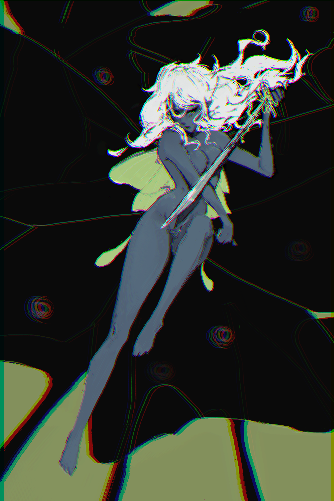
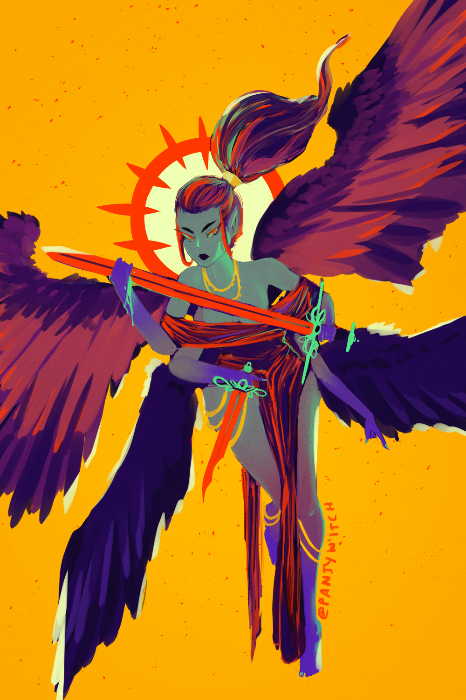
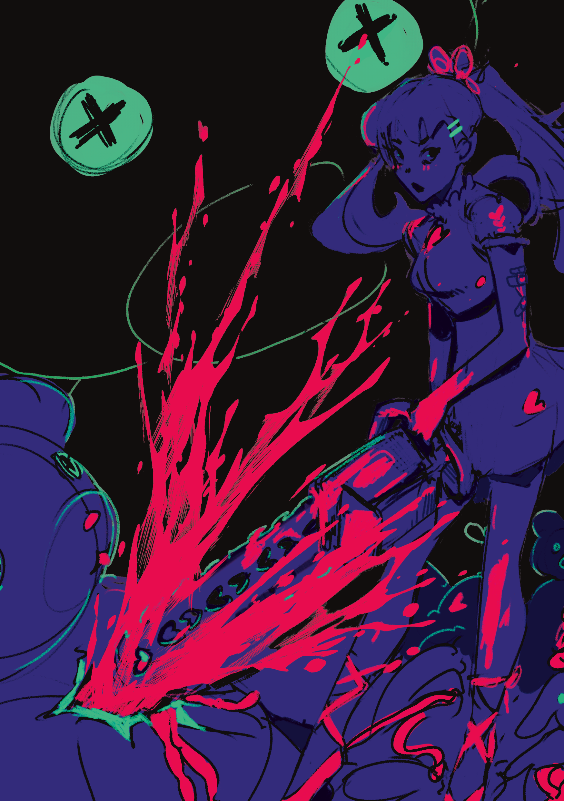
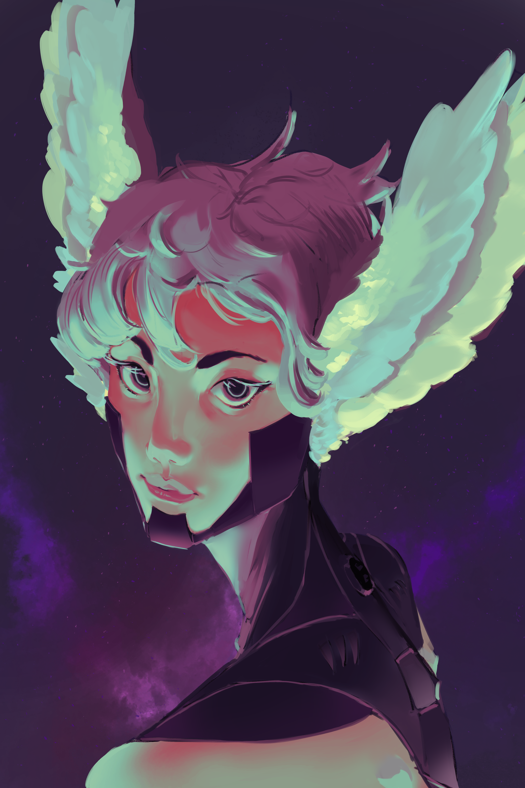
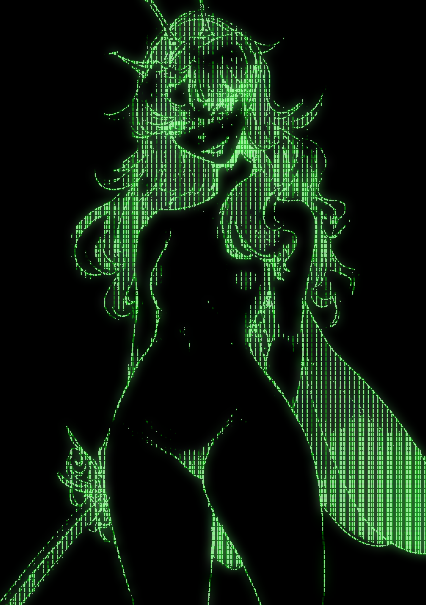
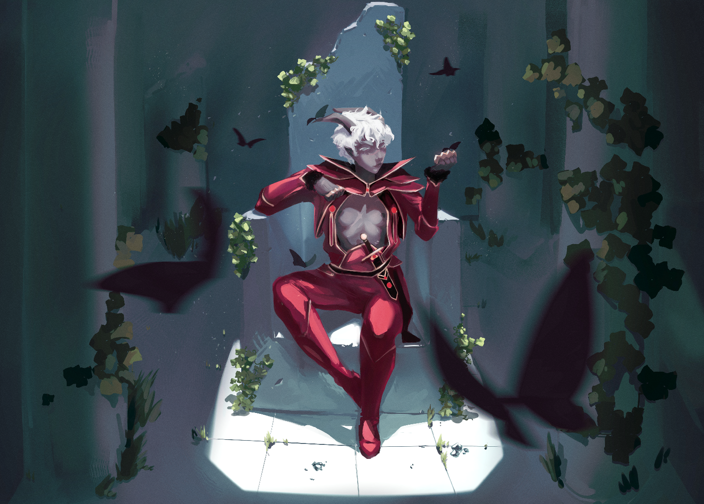
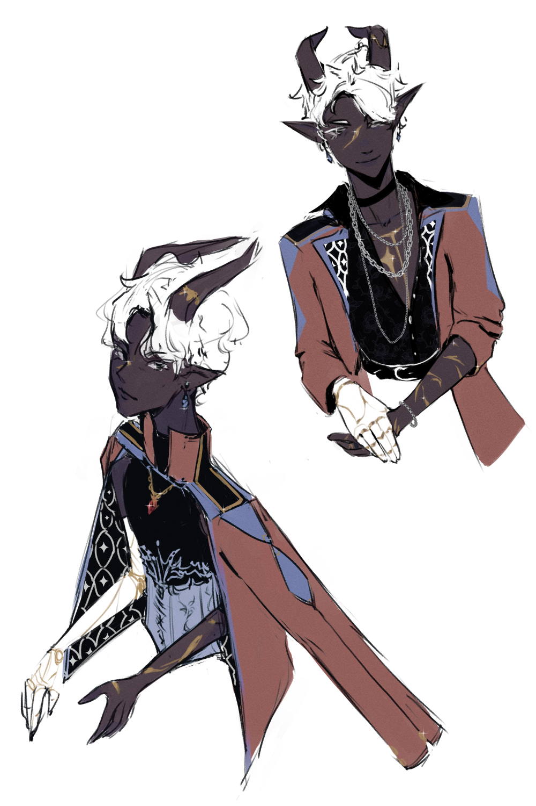
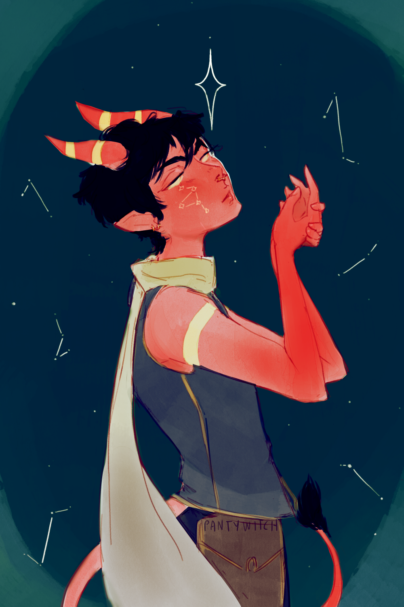

<link rel="stylesheet" href="https://cdn.jsdelivr.net/npm/@shoelace-style/shoelace@2.3.0/dist/themes/light.css" />

<sl-carousel class="carousel-thumbnails" navigation loop style="height: 1200px; max-width: 800px;">
  <sl-carousel-item>
    
  </sl-carousel-item>
  <sl-carousel-item>
    
  </sl-carousel-item>
  <sl-carousel-item>
    
  </sl-carousel-item>
  <sl-carousel-item>
    
  </sl-carousel-item>
  <sl-carousel-item>
    
  </sl-carousel-item>
  <sl-carousel-item>
    
  </sl-carousel-item>
  <sl-carousel-item>
    
  </sl-carousel-item>
  <sl-carousel-item>
    
  </sl-carousel-item>
  <sl-carousel-item>
    
  </sl-carousel-item>
  <sl-carousel-item>
    
  </sl-carousel-item>
  <sl-carousel-item>
    
  </sl-carousel-item>
  <sl-carousel-item>
    
  </sl-carousel-item>
  <sl-carousel-item>
    
  </sl-carousel-item>
  <sl-carousel-item>
    
  </sl-carousel-item>
  <sl-carousel-item>
    
  </sl-carousel-item>
  <sl-carousel-item>
    
  </sl-carousel-item>
</sl-carousel>

  

    
    
    
    
    
    
    
    
    
    
    
    
    
    
    
    
  

